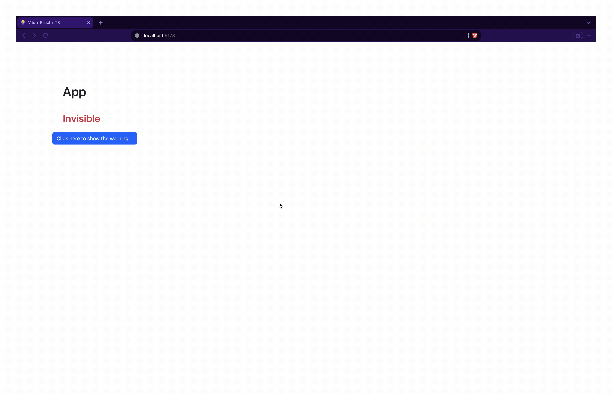

# Visibility : Simple React App

## Description

This is a React application that is used to practice bootstrap button and alerts.

## Features

In this app; props, useState, onClick, onClose, bootstrap classes, and conditional rendering are used.

## Gif

## Installation

1. Clone the repository: `git clone [repository URL]`

2. Navigate to the project directory: `cd [project directory]`

3. Install dependencies: `npm install`

## Usage

1. Start the development server: `npm run dev`

2. Open your browser and navigate to `http://localhost:5173/`

## Contributing

It is just a learning stuff, all type of contributions are well accepted.

## License

by mcc

## Contact

[]: # (<https://mcc1461.com/#home>)
